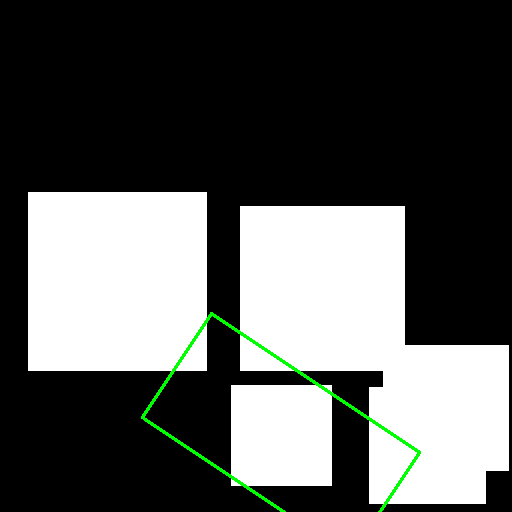
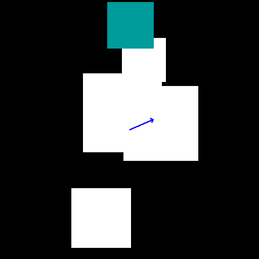

### Gripper Orientator
Example usage:
```bash
python3 gripper_orientator.py
```
This is a class that finds the orientation of a gripper given the original size of the gripper , the depth of the object in camera refernce frame the 2d grasping point in pixels and the sorrounding masks(other object) the score of a given orientation is higher when the gripper mask overlaps with the given object mask and the sorrounding obects. The best score is the lower and the function find_orientation returns the orientation of the gripper that has the best score. the weight of the collision with the same object can be adjusted.
The 2D grasping point can also be determined thanks to a simple function called erode_until_one_pixel, this class function detrmines the grasping point eroding the selected mask until it finds a centroid.




