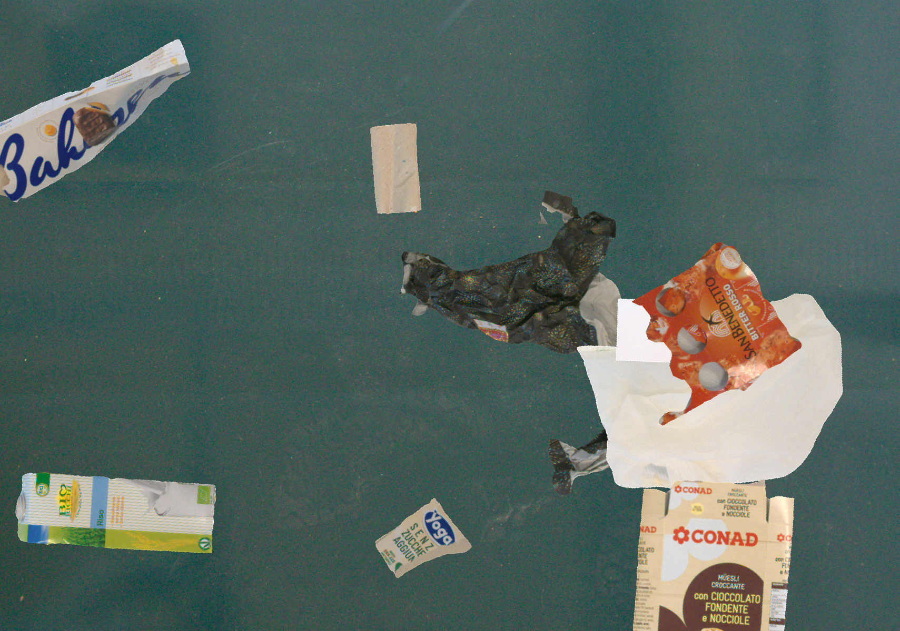
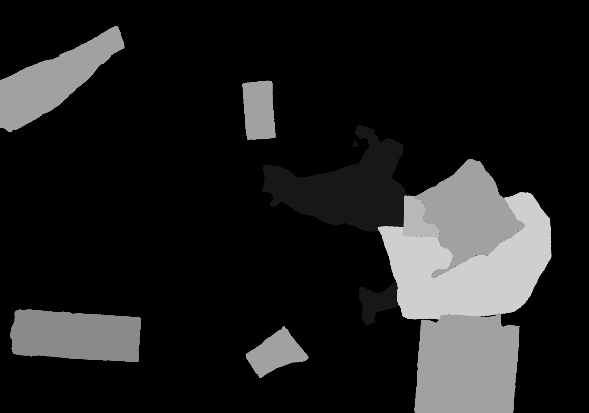

# Data Augmentation

This directory contains scripts related to synthetic data generation.

### Generate Synthetic Images
This scripts comes from the idea that if we have a dataset of single objects but in the real scenario we will have a random mixed number of these objects in the same image, we could randomly cut and pate the objects from the dataset on a background image with random rotation and position as in the two figures below (the image is not a real picture just the random cut and paste of single objects on a common background):

<p align="center">
  
  
</p>

### Your datset structure
your datset must have the following structure, subclass is optional (if there are no subclasses you can ignore the subclass_name folder and put the data inside class_name folder):
```bash
dataset
├── class_name
│   ├── subclass_name
│   │   ├── folder_containing_masks
|   |   |   ├── 000000.png
|   |   |   ├── 000001.png
|   |   |   ├── ...
│   │   └── folder_containing_rgb_images
|   |       ├── 000000.png
|   |       ├── 000001.png
|   |       ├── ...
│   └── subclass_name_1
│       ├── ...
|
├── class_name
│   ├── ...
```
### Usage
First create a config file to determine all the settings for the data generations, an example can be found in the config folder. 

To apply the cut-and-paste method for generating synthetic images, run:

```bash
python generate_synthetic_images.py --config <path_to_yaml_config>
```


