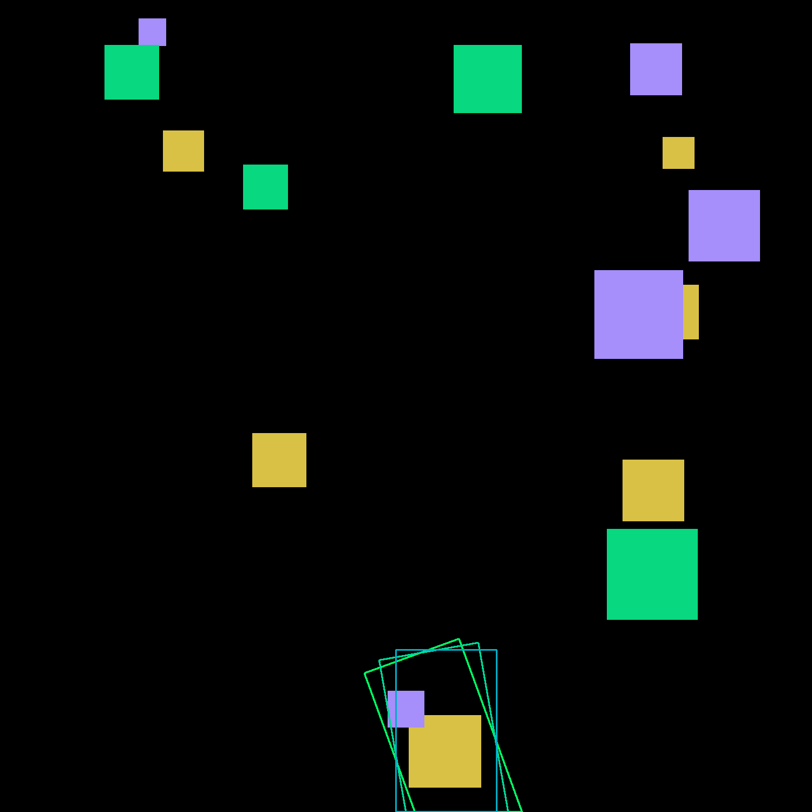
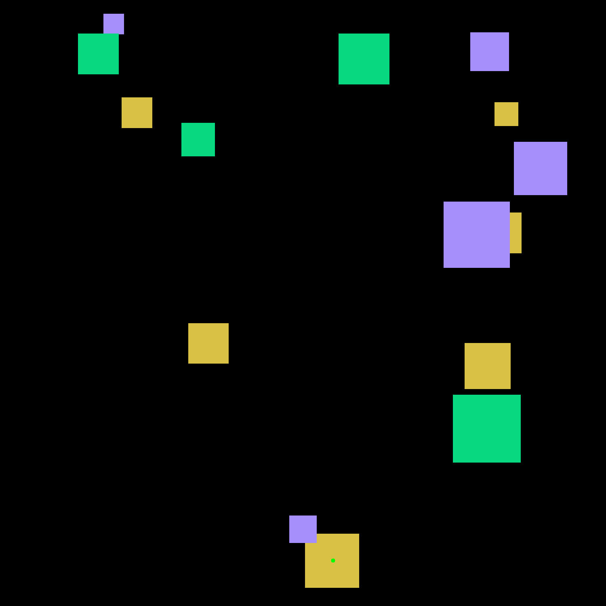

# 🤖 GraspPlanner

## 📄 Overview 

The `GraspPlanner` class provides tools to compute optimal 2D grasping points and orientations for robotic grippers based on segmentation masks and (optionally) depth maps.

### 🔍 Key Features

- **Grasp Point Detection**: Uses morphological erosion to detect stable grasp points within segmented objects.
- **Scoring and Ranking**: Scores grasp points using one of three criteria:
  - `bigger_area`: Prefer larger object regions.
  - `depth_max`: Prefer deeper regions (requires depth map).
  - `depth_min`: Prefer shallower regions (requires depth map).
- **Orientation Estimation**: Finds the best gripper orientation rotating the gripper bbox around the grasp point (at centre) using PCA and collision-aware scoring.

---


## 📦 Installation 
Install dependencies using `pip`:

```bash
pip install opencv-python numpy shapely scipy
```

## 🛠️ Usage
1. Initialize the Grasp Planner
```bash
from grasp_planner import GraspPlanner
planner = GraspPlanner()
```
2. 🎯 Find grasping points
```bash
points = planner.find_grasping_points(
    mask=segmentation_mask,
    desired_class=1,                  # Optional: target object class
    criterion="bigger_area",          # Options: "bigger_area", "depth_max", "depth_min"
    depth=depth_map                   # Optional: required for depth-based scoring
)
```
It returns an Nx4 np.array containing points in this format [x,y,class,score] sorted by score in descending order. The scoring depends on criterion and is between 0 and 1.


3. 🧭 Compute Best Gripper Orientation
```bash
(vector_pair, gripper_bbox) = planner.find_point_orientation(
    mask=segmentation_mask,               # HxW multi class mask where dtype == np.uint8; 0 is background and n>0 == object belonging to class n
    point2d=(x, y),                       # Minimal info (x,y) other infos like class, score etc. are ignored
    gripper_width_x=0.4,                  # Gripper width (metrical (same unit as depth_point) 
                                          # or pixels if depth_point is None )

    gripper_height_y=0.2,                 # Gripper height (metrical (same unit as depth_point) 
                                          # or pixels if depth_point is None )

    depth_point=0.4,                      # Depth value at grasp point can be in any metrical unit (meters,mm etc.) 
                                          # but the unit must be equal to gripper_height_y and gripper_width_x. if None
                                          # gripper_width_x gripper_height_y must be expressed in pixels

    f_x=500,                              # Camera focal length (x) in pixels
    f_y=500,                              # Camera focal length (y) in pixels
    angle_rad_inerval=math.pi / 18,       # Angular search interval in radians
    initial_guess_importance=1.0,         # Weight for PCA orientation the smaller the greater importance ( min=0)
    desired_object_importance=1.0         # Penalize overlap with the grasped object greater penalize more (min=-1)
)
```
It returns

vector_pair: a Tuple of forward and inverse (+180 deg) direction unit vectors. 

gripper_bbox: (polygon) rotated bounding box of the gripper 
## 🖼️ Visualization Utilities
Draw a Grasp Point
```bash
store_image_with_point(image, point=(x, y), filename="point.png")
```
Draw Gripper Orientation
```bash
store_image_with_orientation(image, orientation=vector, filename="orientation.png")
```
Draw Gripper Bounding Box
```bash
store_image_with_gripper_bbox(image, gripper_bbox=polygon, filename="bbox.png")
```
## Example
There is a testing example where parameters can be tuned that generates random segmentation masks and generates grasping point + generates orientation. To run
```bash
cd grasping
python -m examples.test_grasp_planner
```
## 📝 Notes
- Segmentation mask must use integer class labels. Class 0 is treated as background. The classes can also not be contiguous like [1,2,3,4] but also [56,32,8] just make sure classes stay in the range 8-bit unsigned int
- Depth-based orientation scoring requires valid depth_point, f_x, and f_y.
- Depth-based grasping point detection can be done with "depth_max", "depth_min" criteria but a valid depth map must be given
- To find orientation, the 2D point can also just be [x,y] any other field is ignored [x,y,...etc...]

### Gripper Orientator
Example usage:
```bash
python3 gripper_orientator.py
```
This is a class that finds the orientation of a gripper given the original size of the gripper , the depth of the object in camera refernce frame the 2d grasping point in pixels and the sorrounding masks(other object) the score of a given orientation is higher when the gripper mask overlaps with the given object mask and the sorrounding obects. The best score is the lower and the function find_orientation returns the orientation of the gripper that has the best score. the weight of the collision with the same object can be adjusted.
The 2D grasping point can also be determined thanks to a simple function called erode_until_one_pixel, this class function detrmines the grasping point eroding the selected mask until it finds a centroid.




### 👤 Authors
Francesco Bordignon 

